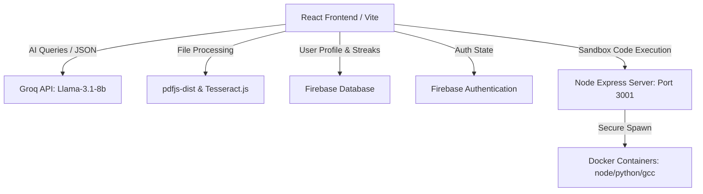

# 🤖 InterviewAI — Advanced AI Mock Interview Coach

InterviewAI is a production-grade career platform designed to help candidates prepare for coding, system design, frontend, and backend interviews. It leverages high-performance LLM engines (Groq), client-side OCR parsing, and secure dockerized runtime environments to simulate professional interviews, score DSA problem submissions, and critique resumes.

---

## ✨ Features

### 🎙️ 1. Interactive Mock Interview Room
* **Real-time AI Audio & Text Dialogs**: Interact with an AI interviewer modeled after custom industry roles (Full-Stack, Backend, Frontend, Data Science).
* **Smart Session Timer**: A smart, non-blocking timer tracks duration and pauses automatically during active AI audio feedback.
* **webcam & Audio Visualization**: Mock video feed layouts with dynamic speaking wave visualizers.
* **Cheat Detection Index**: Evaluates browser tab changes and page focus loss to produce a "trust index score".

### 📊 2. Performance Analytics Dashboard
* **Score Progress Charts**: Interactive graph visualizers powered by Recharts charting mock progression over time.
* **Achievements Drawer**: Unlocks dynamic, tiered medals (e.g. *XP Millionaire*, *Mastery levels*) as candidates hit interview milestones.
* **Interactive Session List**: Inspect, read detailed transcripts/critiques, or delete past mock history reports.

### 💻 3. Coding Arena & Secure Sandboxed Runner
* **60 DSA Question Bank**: Multi-level curated bank containing 20 Basic, 20 Intermediate, and 20 Advanced problems.
* **Isolated DSA Practice & Mock Assessments**: Dynamically swaps views to support standalone practice or official graded mock assessments.
* **Dockerized Code Compilation Engine**: Sandbox server executes code against customized test assertion suites:
  * **JavaScript**: Runs inside `node:18-alpine`
  * **Python**: Runs inside `python:3.9-slim`
  * **C++**: Compiles and executes inside `gcc:latest`

### 📄 4. Resume & ATS Analyzer
* **Multi-Format Extraction**: Parses standard selectable PDFs, `.txt` copy-pastes, and markdown documents.
* **Tesseract OCR Fallback**: Automatically invokes optical character recognition via client-side `tesseract.js` if the uploaded PDF is a scanned, un-selectable image document.
* **ATS Compatibility Grading**: Evaluates resume density against target job postings, listing found/missing keyword checklists, critiquing weak action items, and providing AI-optimized rewrites.

### ⚙️ 5. User Profile & Settings
* **Firestore Synchronization**: Synchronizes user details, streaks, total XP, and levels to a remote database in real-time.
* **Danger Zone Operations**: Provides one-click data wipe mechanisms to clear Firestore analytics.

---

## 🛠️ System Architecture



---

## 🚀 Getting Started

### 1. Prerequisites
Ensure you have the following installed on your machine:
* **Node.js** (v18.x or higher)
* **npm** (v9.x or higher)
* **Docker Desktop** (Required for code sandbox execution in the Coding Arena)

### 2. Environmental Configurations (`.env`)
Create a `.env` file in the root directory and add the following keys:
```env
# Firebase Configuration
VITE_FIREBASE_API_KEY=your_firebase_api_key
VITE_FIREBASE_AUTH_DOMAIN=your_firebase_auth_domain
VITE_FIREBASE_PROJECT_ID=your_firebase_project_id
VITE_FIREBASE_STORAGE_BUCKET=your_firebase_storage_bucket
VITE_FIREBASE_MESSAGING_SENDER_ID=your_firebase_messaging_sender_id
VITE_FIREBASE_APP_ID=your_firebase_app_id

# AI Provider API Key (Groq SDK)
VITE_GROQ_API_KEY=your_groq_api_key
```

### 3. Installation
Clone the repository and install npm packages:
```bash
npm install
```

### 4. Running the Code Sandbox Server
To compile code solutions locally in the Coding Arena:
1. Open Docker Desktop to start the daemon.
2. In your terminal, launch the local execution server:
```bash
node server.cjs
```
> The sandbox server runs on `http://localhost:3001` and spawns standard Alpine-based node, python, or gcc docker instances to securely run tests.

### 5. Running the Frontend
In another terminal instance, spin up the local development Vite server:
```bash
npm run dev
```
> Open `http://localhost:5173` (or the displayed port) in your browser to launch the application.

---

## 🧪 Production Build & Linting

### Compile Client
To build optimization chunks for production:
```bash
npm run build
```

### Lint Files
To inspect codebase for syntax rules:
```bash
npm run lint
```
